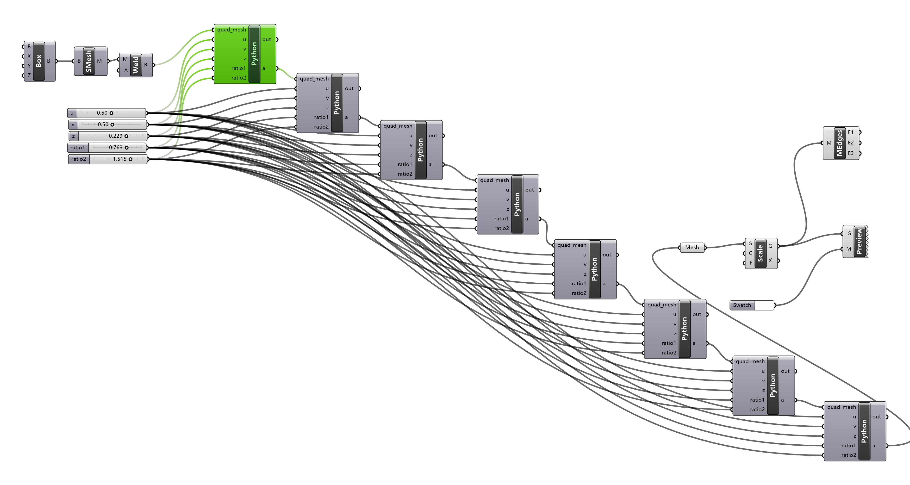

a grasshopper-python implementation of catmull-clark mesh subdivision with behavior control parameters

[reference: Digital Grotesque](https://dbt.arch.ethz.ch/project/digital-grotesque-at-centre-pompidou/)

[reference: Catmull-Clark Algorithm](https://en.wikipedia.org/wiki/Catmull%E2%80%93Clark_subdivision_surface)