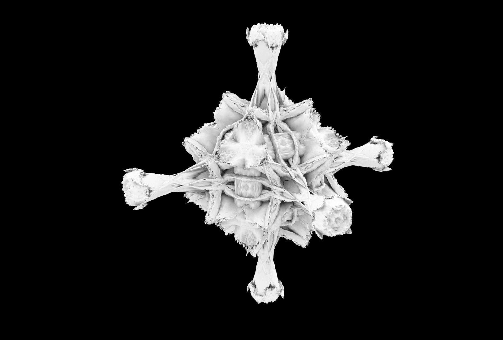

# A grasshopper-python implementation of catmull-clark mesh subdivision with behavior control parameters

An eight-iteration example:

The implementation is for one-iteration only. Multiple iterations is achieved by stacking the components (therefore each iteration can have different behavior control parameters).

Updating the current implementation such that the num. of iterations is user-controlled should be very easy.

[reference: Digital Grotesque](https://dbt.arch.ethz.ch/project/digital-grotesque-at-centre-pompidou/)

[reference: Catmull-Clark Algorithm](https://en.wikipedia.org/wiki/Catmull%E2%80%93Clark_subdivision_surface)